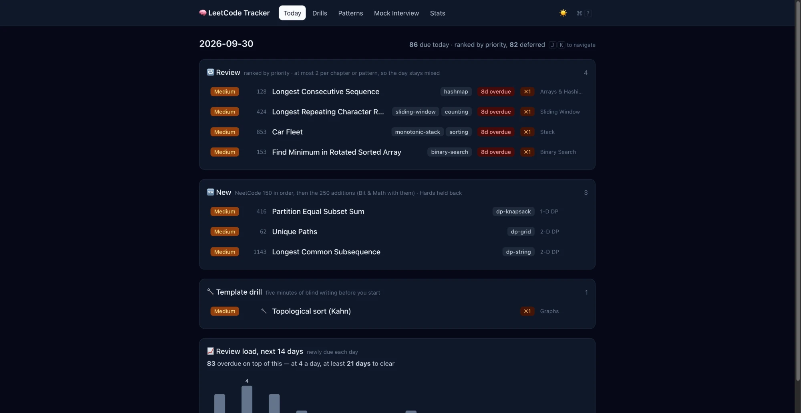
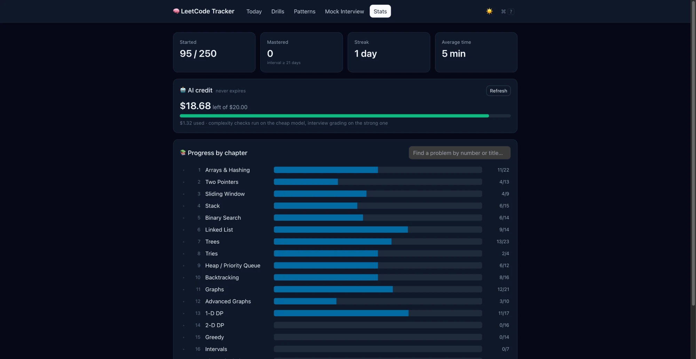

# LeetCode Tracker

[](https://github.com/capy-zhiao/leetcode-tracker/actions/workflows/ci.yml)


A study tracker for NeetCode 150 plus two LeetCode study plans, Top Interview 150 and
LeetCode 75 (272 problems in total, since the lists overlap). It picks what to practice
each day, schedules
reviews with spaced repetition, and checks your time and space complexity answers.

I built it because my markdown study plan stopped working past a hundred or so problems.
Keeping track of review dates by hand wasn't realistic.

## What's in it

### Today



The home page. It has three lists:

- **Review**: problems due for another pass, ranked by how overdue they are and how often
  you've failed them. At most two per chapter, so a day isn't all one topic
- **New**: the next problems you haven't done: NeetCode 150 first in NeetCode's order,
  then Top Interview 150, then LeetCode 75, each in LeetCode's study-plan order
- **Template drill**: one algorithm template to write from memory before you start

Each row shows the difficulty, the pattern tags, how overdue it is, and how many times
you've failed it. The chart at the bottom shows how many reviews come due over the next two
weeks, plus how long the current backlog will take to clear.

### Solving a problem

Clicking a problem opens the solve page: a timer, a code editor, and a short form. You pick
a grade (again / hard / good / easy, with a suggestion based on your time) and enter the
time and space complexity before you can submit. The grade decides when the problem comes
back.

If an LLM is set up, your complexity answer is then checked against the code you actually
wrote. The result has four parts: whether each answer is right, why it's wrong if it is,
the optimal complexity, and your code rewritten to reach it, shown as a diff. Past results
open from the History list at the bottom of the page.

### Drills

The 15 algorithm templates (union-find, grid DFS, Kahn's algorithm, binary search, and so
on), each on its own review schedule. You write one from memory and it's checked against
the lines that usually go wrong, like `find` using `while` instead of `if`. Renaming
variables is fine; missing one of those lines isn't. You see the reference and a diff after
checking.

### Patterns

Progress grouped by technique instead of by chapter, weakest first. Each pattern shows how
many of its problems you've mastered and links to the template drill for it. Expanding a
pattern lists its problems.

### Mock interview

A random problem with a countdown and your notes hidden. When you're done coding, the LLM
reads your code and asks three follow-up questions about it. You answer each in writing
and get a grade, what you missed, and a model answer.

### Stats



Problems started and mastered, your streak, and average time per problem. If an LLM is set
up, it also shows how much API credit is left. Below that is progress by chapter; clicking a
chapter lists its problems, and the search box finds any problem by number or title.

### Other

Dark mode (follows your system setting, or use the toggle in the header) and keyboard
shortcuts for most actions.

## Stack

**Frontend**

- React 18 and TypeScript, built with Vite
- React Router for the pages (Today, Drills, Patterns, Mock Interview, Stats)
- Tailwind CSS. Every color is a CSS variable, which is how dark mode works without
  duplicating styles
- Monaco, the editor from VS Code, for writing solutions. It's bundled locally (works
  offline) and only loads on pages that have an editor

**Backend**

- Python 3.12+, FastAPI, served with Uvicorn
- SQLAlchemy 2.0 with SQLite locally and Postgres in production
- Pydantic v2 for request and response models, pydantic-settings for config from `.env`
- The spaced-repetition logic and daily queue are plain functions with no database or
  clock access, so they're tested directly

**AI (optional)**

- DeepSeek through the OpenAI SDK, so any OpenAI-compatible API works, or Claude through
  the Anthropic SDK
- Used for the complexity check, mock interview questions, and grading your answers
- Each task can use its own model, e.g. a cheaper one for complexity checks

**Testing and CI**

- pytest with FastAPI's test client against an in-memory SQLite database, about 200 tests
- GitHub Actions runs the tests on Python 3.12 and 3.13 and builds the frontend on every push to main

## Running it

```bash
./start.sh
```

This installs dependencies, sets up the database, starts both servers and opens the browser.

Or run them separately:

```bash
# backend
cd backend
python3 -m venv .venv && ./.venv/bin/pip install -r requirements.txt
cp .env.example .env
./.venv/bin/python seed_db.py
./.venv/bin/uvicorn app.main:app --reload

# frontend
cd frontend
npm install
npm run dev
```

Tests: `cd backend && ./.venv/bin/pytest -q`

## AI setup

In `backend/.env`:

```bash
LLM_PROVIDER=deepseek
DEEPSEEK_API_KEY=sk-...
DEEPSEEK_BASE_URL=https://api.deepseek.com     # any OpenAI-compatible endpoint
DEEPSEEK_MODEL=deepseek-v4-pro                  # mock interviews
DEEPSEEK_COMPLEXITY_MODEL=deepseek-v4-flash     # complexity checks (cheaper)
```

For Claude, set `LLM_PROVIDER=anthropic` and `ANTHROPIC_API_KEY`.

With `LLM_PROVIDER=none` everything else still works, and complexity answers are checked
against a built-in answer table instead. When a provider is set, the Stats page shows how
much API credit is left.

## How scheduling works

After each attempt you pick a grade: again, hard, good or easy. The app suggests one from
how long you took, whether you had bugs, and whether you looked at the solution. The grade
sets the next review interval, similar to Anki's SM-2, with shorter intervals for hard
problems.

When more is due than you can do in a day, reviews are ranked by how overdue they are and
how often you've failed them before. A day gets at most two reviews from the same chapter,
so you don't end up with four graph problems in a row.

New problems cover the NeetCode 150 first, in NeetCode's order, then Top Interview 150, then
LeetCode 75. The two LeetCode lists follow their own study-plan order, and a problem in
more than one list only shows up once.
Hard problems come last.

Most of this can be adjusted in `backend/.env` (see `.env.example`).

## Shortcuts

Space starts and stops the timer, 1 to 4 pick a grade, Cmd+Enter submits, J and K move
through the queue. Press `?` in the app for the full list.

## Data

The problem list combines two sources:

- NeetCode 150, from my NeetCode notes. `python3 scripts/extract_seed.py` turns the
  markdown into `data/seed.json`, including my notes and solutions
- LeetCode's [Top Interview 150](https://leetcode.com/studyplan/top-interview-150/) and
  [LeetCode 75](https://leetcode.com/studyplan/leetcode-75/).
  `python3 scripts/fetch_study_plans.py` saves both to `data/`

`backend/seed_db.py` builds the problem set from these. Problems that drop out of every
list are removed, unless you've already practiced them. Problems in a LeetCode study plan
link to LeetCode; the rest link to NeetCode.

## Deploying

Frontend on Vercel (`frontend/`), backend on Railway or Render (`backend/`, Procfile
included), Postgres through `DATABASE_URL`. If it's public, set `API_KEY` on the backend
and `VITE_API_KEY` on the frontend.
